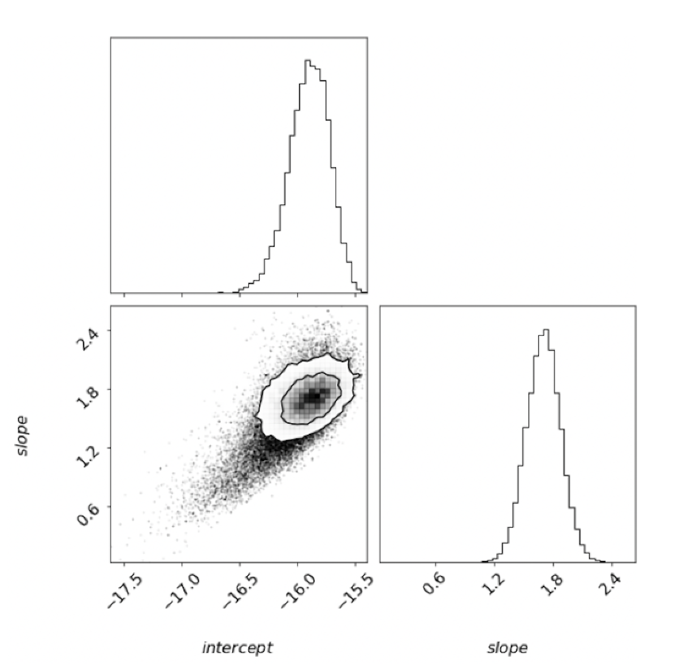
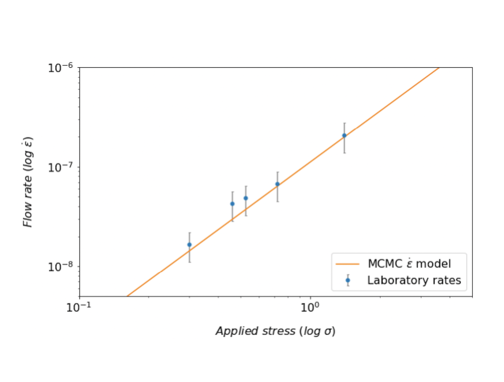

## `lwMCMC` Markov Chain Monte Carlo in Python

---

Parameter space sampling with lightweight Markov Chain Monte Carlo (MCMC) with the trivial metropolis hastings algorithmm. The operations are powered by NumPy. 

## Example 1: Experimental Geophysics Modeling

---

Posterior model parameter distributions with  contours | MCMC model with a prior on the slope
:---------------------------------:|:----------------------------------------:
 | 

Recovered parameter constraints for power law flow model for ice sheets (near-surface depths). In the grid "corner" plot, the entries reveal the 1-dimensional posterior distributions of our parameters, as well as the pairwise projections alongside one and two sigma error contours. We set a prior on the power law exponent from the ice physics literature 1.8 +- 0.225 to generate our estimate 1.70 +- 0.17.

## Example 2: Simulation of Particle Decay

---

Posterior distributions with  contours | Decay model with  prior (simulated). 
:---------------------------------:|:----------------------------------------:
 | 

Recovered parameter constraints for a particle decay simulation: . We include a prior on the decay constant . Also see the corner plot (see above description). 

## Class Functions 

---

A lwMCMC object has the following functions:
        
* mcmc.step() takes a single step of the chain.

* mcmc.burn(nburn) runs the chain for nburn steps, but it doesn't save
            the values.

* mcmc.run(nsteps) runs the chain for nsteps steps, saving the results.

* mcmc.accept_fraction() returns what fraction of the candidate steps
            were taken.

* mcmc.get_samples() returns the sampled theta values in 2d numpy array.
* mcmc.plot_hist() plots a histogram of the sample values for each
            paramter.  As the chain runs for more steps, this should get
            smoother.
        
* mcmc.plot_samples() plots the sample values over the course of the 
            chain.  If the burn in is too short, it should be evident as a
            feature at the start of these plots.
    
* mcmc.calculate_mean() returns mean of all samples for each parameter.
* mcmc.calculate_cov() returns the covariance matrix of the paramters.
